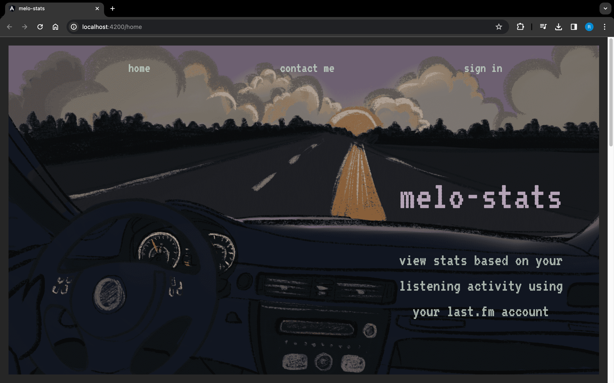

# Last.fm Music Statistics

A powerful web application that harnesses Last.fm user data to provide in-depth insights into your music listening habits. Dive into detailed statistics and visualizations based on your Last.fm username.

## Table of Contents

1. [Installation](#installation)
2. [Usage](#usage)
3. [Configuration](#configuration)
4. [Features](#features)
5. [How To Use](#how-to-use)
6. [Screenshots](#screenshots)

## Installation

1. Clone the repository.
2. Install dependencies:

   ```bash
   npm install
   
## Usage

  cd spotify-project/client
  ng serve

## Configuration

Set up Last.fm API key in 'view.component.ts', 'heatmap.component.ts', 'last-fm.service.ts' files.

## Features

1. **Yearly Play Count Heatmap**:
   1. Visualize your yearly play count with an interactive heatmap.
   2. Discover patterns and trends in your music listening over the years.
   3. Identify the date with the highest scrobbles and the average scrobbles per year.
      
2. **Artist Insights**:
   1. Gain profound insights into your favorite artists.
   2. Pie chart: Compare listened to vs. unlistened songs.
   3. Discover the first time you heard the artist and the specific song.
   4. Bar chart: Explore the play count for each song related to the artist.
   5. Identify songs you haven't heard yet and add them to your listened list.
      
3. **Listen and Regenerate**:
   1. Enhance your data by marking songs as listened.
   2. Regenerate data to keep your statistics up-to-date.

## How To Use
1. Enter your Last.fm username.
2. Choose between the "Yearly Play Count Heatmap" and "Artist Insights" options.
3. Explore the visualizations and insights.

## Screenshots




